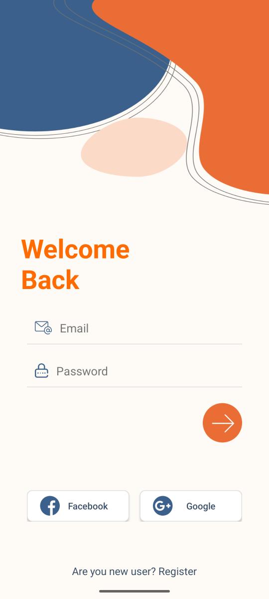
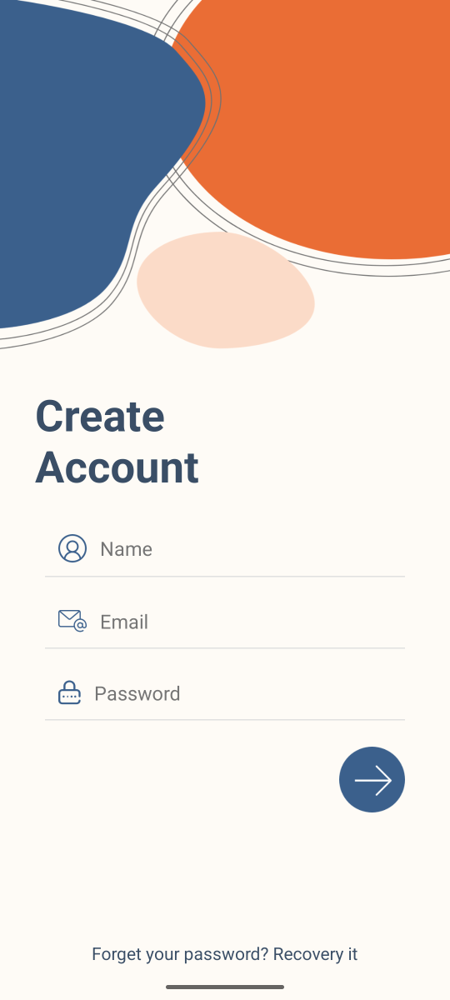

# PERSONAL_MOBILE_APP_BAI02

## Introduction

MOBILE_PERSONAL_APP is a personal mobile application developed on **Android Studio**. It helps users manage their daily activities easily and efficiently. The app includes essential features such as task tracking, reminders, and personal notes.

---

## User Interface Preview

### Giao diện người dùng

Dưới đây là ảnh chụp giao diện chính của ứng dụng.

#### Đăng nhập (Login)


- Phần nhập: Email/Username, Mật khẩu  
- Ghi chú: Thiết kế đơn giản, dễ thao tác trên điện thoại

#### Đăng ký (Sign up)


- Trường thông tin: Họ tên, Email, Mật khẩu, Xác nhận mật khẩu 
- Ghi chú: Kiểm tra hợp lệ đầu vào và thông báo lỗi rõ ràng


---

## Features

* Manage personal tasks and daily schedules
* Set reminders and notifications
* Create and edit personal notes
* Synchronize data between devices
* Simple and responsive web interface

---

## Technologies Used

* **IDE:** Android Studio
* **Language:** Java / Kotlin
* **UI Framework:** XML Layout
* **Database:** Mysql / Firebase
* **Version Control:** Git & GitHub

---

## How to Run

1. Clone the repository:

   ```bash
   git clone https://github.com/xinloihuy/PERSONAL_MOBILE_APP_BAI02
   ```
2. Open the project in **Android Studio**.
3. Wait for Gradle to finish building the project.
4. To run the app:

   * **Option 1:** Use the **Android Virtual Device (AVD)** emulator.
   * **Option 2:** Connect a **real Android device** via USB and enable **USB Debugging**.
5. Click **Run ▶** in Android Studio to install and launch the app.

---

## Author

**Name: Xín Lợi Huy**
**Email: [23110231@student.hcmute.edu.vn](mailto:23110231@student.hcmute.edu.vn)**
**Phone number: 0339969176**

---
